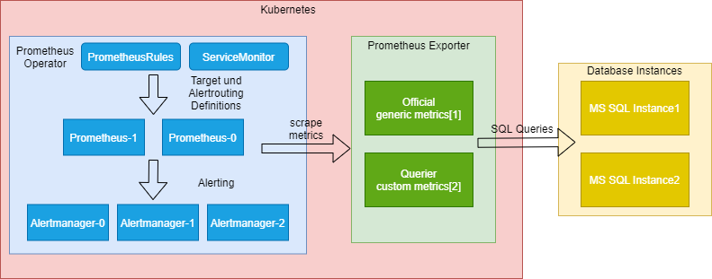

# Kubernetes MS SQL Server Exporter

Deploy MSSQL exporters on k8s and expose them to a Prometheus Operator.

Following exporters will be deployed:

- <https://github.com/awaragi/prometheus-mssql-exporter>
- <https://github.com/DanielOliver/mssql_exporter>



[1] [generic metrics](https://github.com/mabegglen/kubernetes-mssql-exporter/blob/master/exporter/configmap_querier.yaml#L7)
[2] [custom metrics](https://github.com/awaragi/prometheus-mssql-exporter/blob/master/metrics.js)

## Deploy

```bash
NAMESPACE=
kubectl -n ${NAMESPACE} create secret generic mssql-connectionstring --from-literal=ConnectionString='Server=tcp:mssqlserver,1433;Persist Security Info=False;Initial Catalog=master; User ID=USER;Password=PW;'
kubectl -n ${NAMESPACE} create secret generic mssql-credentials --from-literal=username='USER' --from-literal=password='PW' --from-literal=server='SERVER' --from-literal=port='PORT'
kubectl -n ${NAMESPACE} apply -f exporter/
```

## Access Exporter

```bash
kubectl -n dp-monitoring-poc port-forward svc/mssql-exporter-querier 8000
kubectl -n dp-monitoring-poc port-forward svc/mssql-exporter-official 4000

curl localhost:8000/metrics
curl localhost:4000/metrics
```

## Add ServiceMonitor

Prometheus setup: <https://github.com/helm/charts/tree/master/stable/prometheus-operator>

```bash
NAMESPACE=
kubectl -n ${NAMESPACE} apply -f servicemonitor.yaml
```

## Add Grafana Dashboard

Grafana Setup: <https://github.com/helm/charts/tree/master/stable/grafana>

Dashboard based on:
<https://grafana.com/grafana/dashboards/9336>

Deploy modified dashboard:

```bash
kubectl -n ${NAMESPACE} apply -f prometheus_mssql_dashboard.yaml
```
